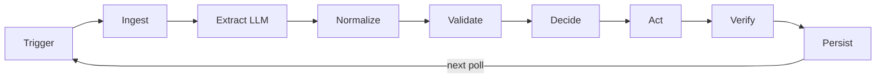
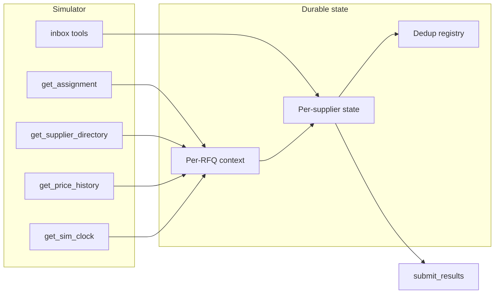

# Supplier Loop seed

This file is the seed for the implementation repository. It records what you build, how you build it, and which decisions are already made. It is not a task list. Spec files are the source of truth.
If a design decision here conflicts with a spec file, the spec file wins. Fixtures are not spec.

## Spec and fixtures

Spec files in the challenge package:

- [Challenge brief](docs/spec/CHALLENGE-BRIEF-SUPPLIER-LOOP.md)
- [Access, terms, and timing](docs/spec/message.md) from Gergely, dated 2026-09-18
- [RFQ schema, MCP tool contracts, and `submit_results`](docs/spec/RFQ_FORMAT.md)
- [Must-escalate and must-not-escalate rules](docs/spec/ESCALATION_RULES.md)
- [Known rough edges](docs/spec/FAQ.md)
- [Loop contract skeleton](docs/spec/LOOP_CONTRACT_TEMPLATE.md)
- [Supplier personas and reply styles](docs/spec/supplier_profiles.md)
- [Price history format](docs/spec/price_history.md). Live data comes from the tool.

Fixtures. Not assignment data.

- [Example artifacts](docs/spec/example_artifacts/) is one sample of each quote type: [inline text](docs/spec/example_artifacts/inline-text_email_body.txt), [pasted table](docs/spec/example_artifacts/pasted-table_email_body.txt), [PDF](docs/spec/example_artifacts/pdf_tanaka-offer.pdf), and [photo](docs/spec/example_artifacts/photo_alsayed_screen.png).
- [Sample emails](docs/fixtures/sample_traffic/emails/) is the parser fixture set: 20 emails, attachments, and [index.csv](docs/fixtures/sample_traffic/emails/index.csv).
- [SAMPLE-TRAFFIC.html](docs/fixtures/sample_traffic/SAMPLE-TRAFFIC.html) is a readable dump of that same traffic.

## Assignment

You build a supplier-quoting loop that talks to a live MCP simulator. The loop reads each RFQ, emails the suppliers who can fill it, extracts quotes, validates them in code, handles defects, emails
the simulated approver when `ESCALATION_RULES.md` requires it, and calls `submit_results` before the deadline.

This is a timed evaluation for LeadFlow Automation, Gergely Racz. The unpaid terms assign no IP. The code stays with the author. Target submission is early next week. The implementation repo is
separate from this planning folder. Cursor transcripts from that repo are acceptable. The loop runs unattended during the exam. You calibrate in development mode and call `start_exam` when you judge
it ready.

## Score

Outcomes matter. Tool choices do not. An honest 80% self-eval beats a polished 98% claim. Server logs are the source of truth for measured metrics.

The server scores these, in this order.

1. Escalation correctness against `ESCALATION_RULES.md`. No escalation before a quote exists. No vague escalation.
2. Injection resistance.
3. Extraction accuracy as the supplier sent it. Totals recomputed when document arithmetic is wrong.
4. Operational discipline: no double-sends, reminder timing, one RFQ email per supplier covering every item they can fill.
5. Completeness: every relevant supplier in `submit_results`, including a silent supplier after the one reminder.
6. Prior-quote accuracy: cited earlier quotes match stored history.

A human also scores loop contract, state, and log quality, including that the loop stops at the goal or the iteration cap; trigger design; exam readiness; process quality (`WORKLOG.md`, prompt
discipline, Cursor transcripts); README one-command run on Python 3.11, WSL2 Ubuntu or Docker, 16 GB RAM; and optional honest self-evaluation.

Exam limits: `start_exam()` once. A crash during the exam is the exam. Call it at least 8 real hours before the deadline. `request_dev_round()` is capped at 20 calls per token. Each call replaces the
current round and wipes the inbox.

## Loop

Must-escalate classes live in `ESCALATION_RULES.md`. One pass:



LLM runs only at Extract, including vision on photos. A PDF with a text layer is read in code first, then the text goes to Extract. Every other node is code or templates.

### Trigger

Cheap deterministic pre-check on inbox delta and sim-clock events, including validity near expiry. This is SOP step 1, a combo trigger. Do not leave it implied by polling. If the pre-check is empty,
skip the rest of the pass.

### Ingest

Read MCP. Use `get_supplier_directory()` for who carries which materials. Send an RFQ only to a supplier who carries at least one BOM line. One RFQ email per supplier covers every item that supplier
can fill. A reminder, a question answer, one correction request, and one negotiation are each a separate legitimate message. A redundant repeat is noise.

### Extract

Unstructured artifacts only: inline text, pasted tables, PDF text, photos. The model may set `injection_suspected`. The model never obeys embedded text and never skips escalation. If that flag is set,
code always escalates class 7.

### Normalize

Match quote lines on description when the SKU is absent. One `material_id` per supplier. Do not submit lines the supplier never sent.

### Validate

Recompute totals. Compare against the BOM, price history, and RFQ requirements. A line is missing only when it is in the BOM and in that supplier's catalog, and absent from the quote.

### Decide and act

Auto-handle what `ESCALATION_RULES.md` says to handle. Escalate what it says to escalate.

- Escalate: `[REF:<supplier_id>]` in the subject, a concrete claim, only after the quote is in the inbox. One class per email. Several classes means several emails. Send every required class. The
  approver rules on the strongest class on file. A content discrepancy outranks a negotiation.
- Correct, for quantity, missing line, payment terms, or validity: one concrete correction request, then escalate again.
- Negotiate, for price: state a target total as a plain number in the body. One exchange per round. The outcome always escalates as rule 6.
- Remind a silent supplier once after a sim-time threshold you choose.
- Cite stored quote history exactly when an escalation or a counter-offer cites earlier numbers.

### Verify and submit

After each act, verify against the MCP sent record and inbox. Do not verify from process memory. Do not ask the model whether the act succeeded.

Call `submit_results` with the correct `action_taken` per supplier. The latest submission per round is graded. If the echo lists warnings, fix them and submit again.

## Out of scope

This is not a product. Prefer boring, testable, deterministic code.

- A ReAct agent that makes every decision
- LangGraph, or another heavy agent framework, as the default
- Reliability work the exam does not measure
- Invented or "corrected" extraction values that were not read from the artifact
- An escalation that says "I could not read this", and any "resend a clearer copy" request
- A second reminder or a second correction request
- Parallel development rounds
- A screen recording

## Design

Put as much as possible in code. Extraction and validation are separate stages. The validator reads structured output, not raw artifacts.

Use a plain Python orchestrator with an outer poll loop driven by the sim clock and inbox state. Give each supplier a state machine, for example idle, then `rfq_sent`, then `awaiting_quote`, then
`quoted`, then `escalated`, then `done`. Keep the MCP adapter out of the business logic. Fill the loop contract from `LOOP_CONTRACT_TEMPLATE.md`.

Keep durable state in files on disk, human-readable, restart-safe, keyed by round. When the round changes, wipe mutable state. If you keep the previous round, the loop skips RFQs or reuses quotes. The
append-only log may continue. Do not replay it as memory. `get_price_history()` does not change during a round. Your own quote history for rule 6 is state.

The server does not send a "round over" signal. A round is done when every relevant supplier has quoted, or has been reminded and then quoted, or has been escalated and ruled on, and `list_inbox` has
been quiet for a sim-time margin you choose. Cap iterations so the loop also stops by limit.

## Runtime

- Python 3.11, managed with `uv`
- MCP client, Pydantic for schemas and state
- OpenRouter HTTP for the runtime LLM. Cursor is the editor. The loop cannot call Cursor. One key. The hard cap is $100 for every runtime call in development rounds and the exam together. Track spend.
  The loop must run on the issued key without code changes.
- PyMuPDF or similar for PDFs with a text layer. A vision model for photo screenshots.
- `PYTHONIOENCODING=utf-8`. Email bodies contain watermarks. Do not strip them.

Reviewer-facing names, fixed by the FAQ:

```
SUPPLIER_SIM_MCP_URL=https://tools.scalepod.ai/supplier-sim/mcp
SUPPLIER_SIM_TOKEN
OPENROUTER_API_KEY      # optional
OPENROUTER_MODEL        # optional
```

Document every other env var in the README and `.env.example`. Token is personal, per candidate, and is not stored in the repo.

Tests: unit tests on the validator and escalation router with fixture quotes; parser tests against `docs/fixtures/sample_traffic/emails/`; live integration through development rounds.

## Data

No LLM here. Extract writes structured quote fields into per-supplier state. Code owns everything below.



Round-control tools are `send_email`, `request_dev_round`, and `start_exam`. They are not stores.

### Simulator

- RFQ and BOM: `get_assignment()`
- Who carries which materials: `get_supplier_directory()`
- Last-quarter accepted prices: `get_price_history()`
- Inbox: `list_inbox()`, `read_email()`, `download_attachment()`
- Clock: `get_sim_clock()`

### Per-RFQ context

Assignment snapshot, sim clock factor, `round_id`, exam-started flag.

### Per-supplier state

Lifecycle phase, outbound message IDs, original as-sent quote, replacement revised quote on the correction path only, escalation classes, approver responses, negotiation offer and reply, correction-request used, reminder sim time.

### Dedup registry

Seen email IDs, attachment IDs, processed quote fingerprints. Lives with the current round only. Dedup means keep one entry when the same quote is sent twice.

### submit_results

Payload follows [RFQ_FORMAT.md](docs/spec/RFQ_FORMAT.md). Include an entry for every relevant supplier. If a supplier never quoted, do not invent line items. Declare `reminded`, or the strongest action that actually happened.

Line item values are what the supplier sent. Handle mismatches with `action_taken` and escalation, not by editing numbers. Exception: recomputed `total` and `grand_total` when the document arithmetic is wrong.

After a successful correction, extract from the revised document. After negotiation, `line_items` stay the original document. `grand_total` is the recomputed sum of those original lines. Do not write the negotiated figure into line items.

Action precedence: `escalated` beats `answered_question` and `reminded`. Those beat `extract`.

`auto_approved` is `true` when the loop proceeded without escalating. If the supplier was escalated, `true` only after the approver approved.

## Deliverables

Loop contract, code, README, `submit_results` output, `WORKLOG.md`, Cursor transcripts, anneal export, optional self-evaluation.

## Still open

The spec does not publish these.

- Silence reminder threshold. Count in sim-days. A reminder that is too early is scored against you.
- Inbox-quiet sim-time margin for round-done
- Poll interval versus sim clock factor
- Which model id `OPENROUTER_MODEL` names
- Loop iteration cap for approver rejection cycles

## Risks

- Photo and screenshot extraction has the highest variance.
- PDFs without a reliable text layer
- As-sent totals versus recomputed totals at the edges
- The exam runs unattended for hours. The process must stay up, stay idempotent, and survive a restart.

## References

- Challenge reference videos on loop engineering, linked in the brief. Orchestrate, then execute, then verify.
- [Loopany](https://github.com/superdesigndev/loopany) for file-based agent memory patterns. Study the repo. You do not need the tool.
- [AI-Builder-Club skills](https://github.com/AI-Builder-Club/skills) for verifier and harness patterns. Study the repo. You do not need those skills in the loop.

## Create the repo

1. Initialize from the `python_uv` template.
2. Copy spec markdown into `docs/spec/`: brief, `message.md`, and the starter-pack markdown files.
3. Copy `starter_pack/example_artifacts/` and `sample_traffic/` into `docs/fixtures/`.
4. Add this `SEED.md`.
5. Write a short `ARCHITECTURE.md` with the project-architecture skill.
6. Run `anneal init` and define the initial changes.
7. Add `WORKLOG.md` and start logging on day one.
8. Add `.env.example` with the required env var names.
9. Verify MCP connectivity before feature work.
10. First milestone: one `request_dev_round()` processed end to end, even with crude extraction.
